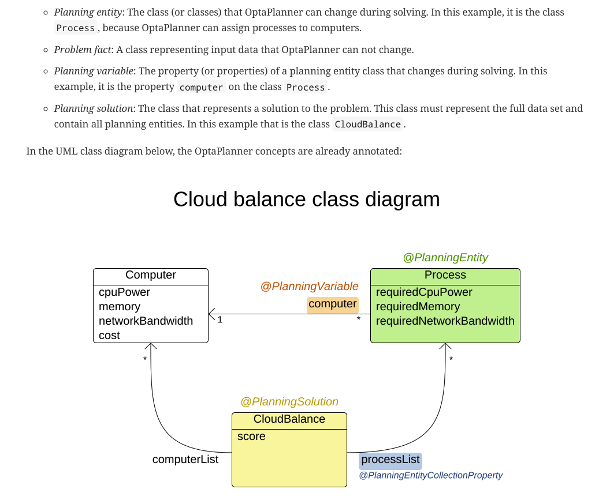
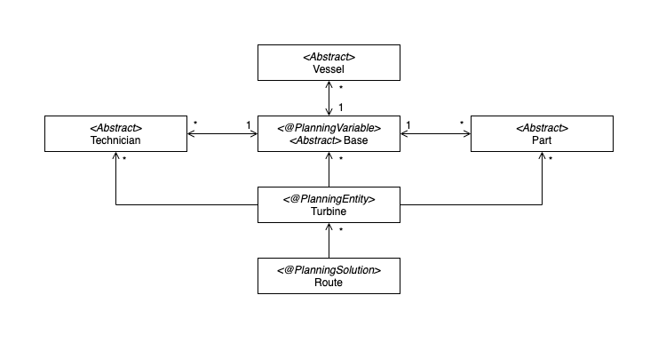

# ideal-opta-journey

## Foundational Class Diagram
According to the official OptaPlanner:

We came out with our foundational class diagram:

*Note:* this is to be changed according to: 
???
 
 

## Files and Directories
- [`docs`](docs/) -> all of our docs with timestamps
- [`legacy`](legacy/) -> legacy files, mostly codes
- [`windfarm-code`](windfarm-code/) -> Working code

 
 

## OptaPlanner
[官方文档](https://docs.optaplanner.org/7.7.0.Final/optaplanner-docs/html_single/)  
不是很有阅读的必要, 更多可以作为一个查资料的地方。

简单来说, 我们指定变量, 指定求解内容, 告诉Opta什么事情是减分项, 什么规则不能破坏(hard), 什么规则要尽量不破坏(soft), 然后opta会根据我们描述的情况求解。

具体内容请参照[docs](docs/), 并根据时间顺序查看文档
