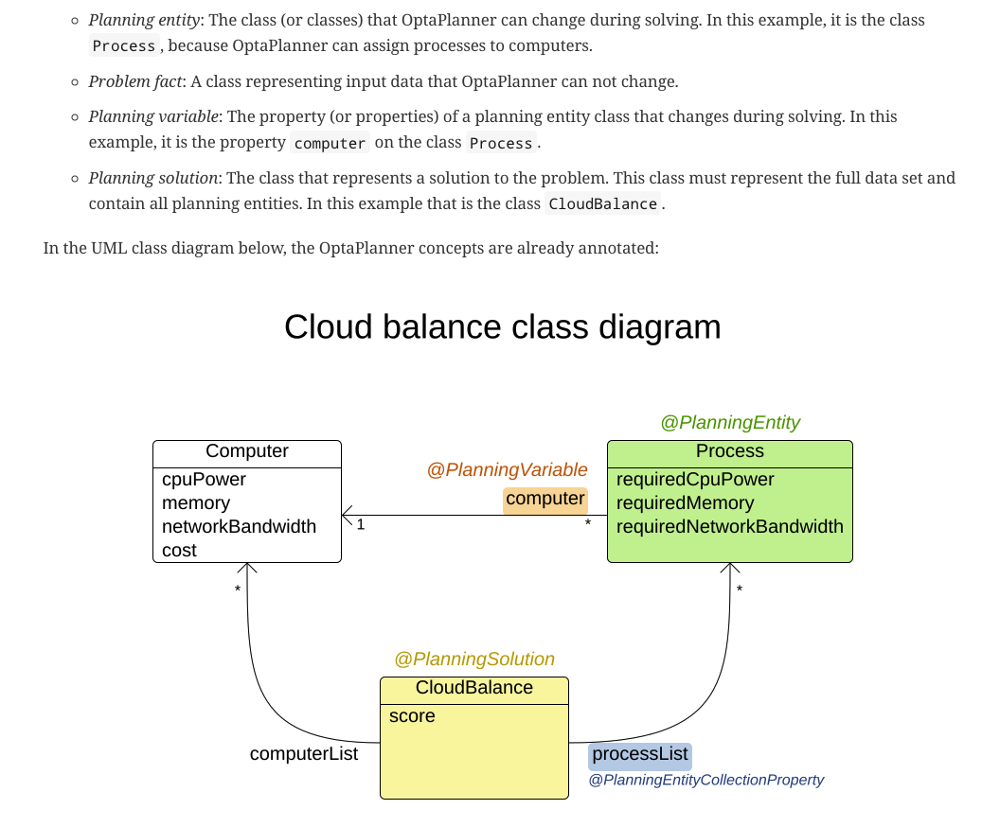
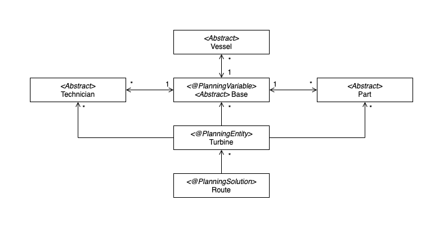

# ideal-opta-journey

## Foundational Class Diagram
According to the official OptaPlanner:

We came out with our foundational class diagram:

## Files and Directories
- [`opta-new`](opta-new/) -> newest project created from `pom.xml`
- [`optaplanner`](optaplanner/) -> created in examples
- [`source`](source/) -> original Java files
- [`windfarm-cxd`](windfarm-cxd/) -> original Java files without error

## Input
TURBINE = `0`
VESSEL = `1`
BASE = `2`
TECHNICIAN = `3`

00 01 02 010 011 
10 
20
30
