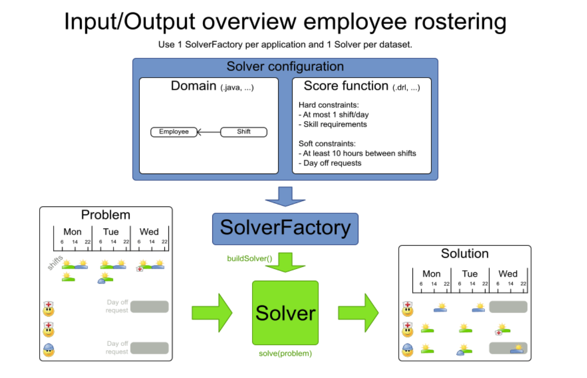

<!-- omit in toc -->
# ideal-opta-journey

**Table of Content**
- [Foundational Class Diagram](#foundational-class-diagram)
- [Files and Directories](#files-and-directories)
- [OptaPlanner](#optaplanner)
  - [Implementation](#implementation)
  - [ScoreCalculator](#scorecalculator)
    - [TimeWindowed](#timewindowed)

## Foundational Class Diagram
According to the official OptaPlanner:


We came out with our foundational class diagram:


*Note:* this is to be changed according to:<br/>
[东冬的抽象建模](docs/files/abstraction.pdf)
<br/>
<br/>

## Files and Directories
- [`docs`](docs/) -> all of our docs with timestamps
- [`legacy`](legacy/) -> legacy files, mostly codes
- [`windfarm-code`](windfarm-code/) -> Working code

<br/>
<br/>

## OptaPlanner
[官方文档](https://docs.optaplanner.org/7.7.0.Final/optaplanner-docs/html_single/) <br/>
不是很有阅读的必要, 更多可以作为一个查资料的地方。

简单来说, 我们指定变量, 指定求解内容, 告诉Opta什么事情是减分项, 什么规则不能破坏(hard), 什么规则要尽量不破坏(soft), 然后opta会根据我们描述的情况求解。

具体开发过程请参照[docs](docs/), 并根据时间顺序查看文档



其中, 建立Domain是最难的部分(这句话不是我说的, 是RedHat的Duncan说的, 还有我一个使用过Opta的Tutor说的)。我们的Opta使用过程中, 也证实了这一点, 而且文档真的起不到半毛钱的帮助。[小鼠叹气, 生活不易]

### Implementation
1. Define domain
2. Define constraints
3. Solve

**Sample Code for Solving**
```Java
// My domain specific class as input
Roster problem = ...;

SolverFactory<Roster> factory = SolverFactory
    .createFromXmlResource(".../mySolverConfig.xml");
Solver<Roster> solver = factory.buildSolver();

// My domain specific class as output
Roster solution = solver.solve(problem);

for (Shift shift : solution.getShiftList()) {
  // Each shift is now assigned to an employee
  System.out.println(shift + ": " + shift.getEmployee());
}
```

### ScoreCalculator
总共有三种ScoreCalculator:
- Easy(Simple) Java (当前使用)
  - Easy to write
  - Slow (to solve)
- Incremental Java
  - Hard to write
  - Hard to maintaine
  - Error prone
  - Potentially fast
- Incremental Drools DRL
  - Learning curve (better if knows declarative)
  - Fast: implicit incremental calculation
- Constraint Streams (暂时不考虑)
  - 使用Java Stream-like API (披着Java的Drools)
  - Fast: implicit incremental calculation


**其中:** Easy的计算方式每次重新计算分数, Incremental的计算方式通过只计算变化的方式加快运算速度

为了计算速度, 数据需要全部提前读入, 计算分数的时候不建议使用IO.

#### TimeWindowed
- `arrivalTime = previousDepartureTime + travelTime`
- `startTime = max(readyTime, arrivalTime)`
- `departureTime = startTime + serviceTime`
