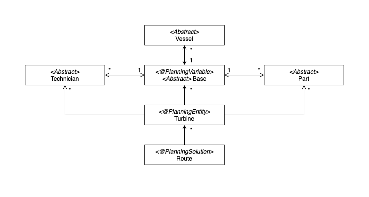

<!-- omit in toc -->
# Implementations - 2020-08-21

**Table of Contents**
- [概括](#概括)
- [Class Diagram](#class-diagram)
- [Implementation](#implementation)
- [Score Calculator](#score-calculator)
- [config.xml, pom.xml and Maven](#configxml-pomxml-and-maven)
- [Output](#output)
- [Version 2](#version-2)
  - [输入](#输入)
  - [ScoreCalculator](#scorecalculator)
- [下周安排:](#下周安排)

## 概括
我们上一周完成了初版的Class Diagram设计, 之后我们小组二人单独完成了代码并进行了讨论与整合<br>
<br>
以上为我们五个不同的版本
<br><br>
之后我们搭建了Maven环境并跑通过一次最基础的case, 以下为我们的成果
```txt
hardscore(0);
softscore(-947);
vessel 001: base b0 -> turbine 006 -> turbine 002 -> turbine 001 -> turbine 003 -> turbine 005
vessel 002: base b0 -> turbine 008 -> turbine 002 -> turbine 007
vessel 003: base b0 -> turbine 004
```
后来在添加 OptaPlanner 的 AnchorShadowVariable (Part, Technician等) 的时候, 因为操作不当(文档太烂)更改了Maven环境的设置, 导致了目前程序无法运行。现在还在修复/调试的过程当中。
<br><br>

## Class Diagram
上一周我们完成了初版Class Diagram的设计

<br><br>

## Implementation
我们建立了与Class Diagram相对应的以及OptaPlanner所需要的Java Classes:
- 其中与Class Diagram相对应的有 (与OptaPlanner系统没有直接关联的Entity之后会将作为Abstract Classes以方便Future Implementation)
  - `Base.java` -> Base Entity (OptaPlanner@PlanningVariable)
  - `Route.java` -> Route Entity (OptaPlanner@PlanningSolution)
  - `Turbine.java` -> Turbine Entity (OptaPlanner@PlanningEntity)
  - `Part.java` -> Part Entity
  - `Technician.java` -> Technician Entity
  - `Vessel.java` -> Vessel Entity
- OptaPlanner所需部件:
  - `App.java` -> main file / executable file
  - `ScoreCalculator.java` -> 用于计算分数 (hardscore and softscore)
<br><br>

后来, 根据设计的方便性, 我们添加了一个Concrete Class与一个Interface
- `Location.java` -> Location Entity
- `Standstill.java` -> Standstill Interface用来表示状态, 船只的每一次停下都算是一个状态
<br><br>

## Score Calculator
我们的目标是让第一个版本尽可能的简单, 使用最少的约束条件先使代码可以运行<br>
以下是我们暂定的分数系统
- Soft Score
  - Distance
- Hard Score
  - Capacity

根据OptaPlanner给出的样例, 我们的ClassDiagram以及我们目前的基础的计分系统, 我们设计出了以下的输入格式:<br>
文件格式: `.csv` - 一行为一个Entry (每一个Entity的bullet points下的所有内容)

- Base
  - id
- Vessel
  - id
  - capacity
  - base
- Turbine
  - id
  - demand
- Location
  - base/turbine
  - longitude
  - lattitude
<br><br>

## config.xml, pom.xml and Maven
我们根据OptaPlanner的文档以及提供的Examples完成了调用OptaPlanner Core的配置
- `config.xml`
  - 提供了PlanningEntity, PlanningSolution, ScoreCalculator等信息
- `pom.xml`
  - 提供了Maven编译信息, 包括了Classes, Libraries之间的dependencies
- Maven
  - 在IntelliJ IDEA中配置好了maven project以运行我们的程序
<br><br>

## Output
```txt
hardscore(0);
softscore(-947);
vessel 001: base b0 -> turbine 006 -> turbine 002 -> turbine 001 -> turbine 003 -> turbine 005
vessel 002: base b0 -> turbine 008 -> turbine 002 -> turbine 007
vessel 003: base b0 -> turbine 004
```
<br><br>

## Version 2
在跑通了基础case之后我们尝试添加了新的Variable, 随之我们也更改了我们的输入与ScoreCalculator:

### 输入
- Base
  - id
- Vessel
  - id
  - capacity
  - base
- Turbine
  - id
  - demand
  - *type needed*
- *Technician*
  - *id*
  - *type*
  - *base (id)*
- Location
  - base/turbine
  - longitude
  - lattitude

### ScoreCalculator
添加了Technician的Score计算
```Java
for (Technician technicianT : turbineTechnicians){
    for (Technician technicianV : vesselTechnicians){
        if (technicianT.getType().equals(technicianV.getType())) {
            vessel.removeTechnician(technicianV);
            hasTechnician = true;
            break;
        }
    }
    if (hasTechnician == false){
        hardScore -= 10;
    }
}
```
<br><br>

## 下周安排:
- [ ] 修复Maven
- [ ] 完成新的classes的添加
- [ ] 测试更为庞大的数据 (继续使用随机生成)
- [ ] 优化输入类型
- [ ] 文档优化