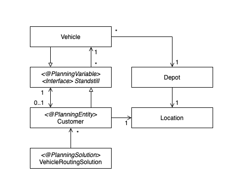

# 约束编程(Constraint Programming)

## Introduction
软约束和硬约束, 不使用数学建模求解方法(Mathematical Programming), 而是使用约束编程(Constraint Programming), 无需输入复杂的数学公式, 基于各个约束条件上求解。约束是对事物的一种限制，规定事物的发展应该遵循什么规则，用于表达出什么是对的，什么是错的，什么情况是最优，什么情况次优，什么情况较差，从而让引擎得到各个解的对比依据。

约束可以分为不同等级，类似于SQL语句里的Order By，前面的字段优先于后面的字段。在这里我们使用硬约束和软约束来将约束划分为两个等级，从而区别出约束的重要程度。
<br><br>

### 硬约束/Hard Constraints
硬约束是指不能违反的约束，违反了就会出现不符合常理，即业务可能出现绝不允许的情况出现。比如超出工作时长，某一个工种不能维修另外一个工种的设备等等。
<br><br>

### 软约束/Soft Constraints
软约束是可违反的，设立软约束之目的并不是不允许它违反，而是定量地制约规划结果的发展方向，起到对规划结果的偏向作用，即让规则结果尽量向指定的一个方向偏移。也就是说在满足了硬约束的前提下，再对软约束进行判断，如果软约束能不违反就最好，要是必须违反，违反得越少，所得的方案就越好。例如效率就是软约束，

然后我们会对这两类约束进行打分，硬约束对应的是硬分数，软约束对应的是软分数。那么得分越高，就表示对应方案的质量越高。在计算这些约束分数的过程中，保持优先优化硬分数、然后在硬分数最优的基础上，再去优化软分数的原则，来寻找最佳方案。例如：两个方案A、B对比，方案A的硬分数比方案B的硬分数高1分，方案B的软分数比方案A的软高出10万分，那么最后还是认为方案A更佳。也就相当于在写SQL脚本时，order by子句中前后两个字段的关系了，靠前的字段排序比靠后的字段更优先。
方案的获得可以通过穷举，但是在大规模的时候可以通过优化算法来帮助更快的获取最优解。
<br><br><br>


## Constraint Programming with OOP
所以我们可以将所有出现的因素设定为一个一个的类，并给每一个类定义它的约束，并设定相应的惩罚分数标准（即将约束量化），当这个约束实打破时，就作出惩罚性记分，那么到最后，扣分越少的方案就越好。

需要被定义的类如下：<br>
`@PlanningEntity`: 在求解过程中可以改变的类。<br>
`@ProblemFact`: 用户输入的数据，在求解过程中不可以改变。<br>
`@PlanningVariable`:  在求解过程中可以更改的@PlanningEntity属性。<br>
`@PlanningSolution`: 代表规划方案的类 。<br>
`@PlanningScore`: 当前规划的分数。<br>

在类定义完成后我们会定义硬约束和软约束，从而计算相对应的分数。分数计算出之后这些分数将会被用在求解器里面，在求解器中我们会有两个阶段Construction Heuristic阶段和Local Search阶段，Construction Heuristic阶段将会在有限的时间内找到一个可行解，然后Local Search会根据Construction Heuristic找到的可行解进行优化，最终找到目前能找到的最优解。

- **Construction Heuristic** 阶段可以用的算法有First fit, Allocate entity from the queue, Allocate from the pool等。
- **Local Search** 阶段可用到的算法有Tabu search, Great Duge等。
<br><br>

### Example
**Vehicle Routing Problem (VRP)**<br>
*硬约束/Hard Constraint*: 不可超过运输工具的负载, 必须在与客户约定时间之前到达\
*软约束/Soft Constraint*: 最小化总路程 (油耗)

**VRP Class Diagram:**<br>


**VRP输入**: 用户ID，用户位置，需要的货量，需要货到达的时间，车的承载量。<br><br>

**计算分数举例**:
```Java
constraint.from(Customer.class).penalizeLong(
                "vehicleCapacity",
                HardSoftLongScore.ONE_HARD,
                (vehicle, demand) -> demand - vehicle.getCapacity());
```
<br><br>

**VRP运行结果**:
```
INFO  VehicleRoutingSolution belgium-road-km-n50-k10 has 1 depots, 10 vehicles, 49 customers,
                                                         with a search space of 10^74.
INFO  Imported: belgium-road-km-n50-k10.vrp
INFO  Solving started: time spent (15), best score (-49init/0hard/0soft)

DEBUG CH step (0), score (-48init/0hard/-33931soft), selected move count (10),
                   picked move (VOSSEM {null -> BRUSSEL/Vehicle-0}).
DEBUG CH step (1), score (-47init/0hard/-142519soft), selected move count (11),
                   picked move (GELINDEN {null -> BRUSSEL/Vehicle-0}).
DEBUG CH step (2), score (-46init/0hard/-172475soft), selected move count (12),
                   picked move (VILLERS-L'EVEQUE {null -> GELINDEN}).

...

DEBUG CH step (47), score (-1init/0hard/-2259153soft), selected move count (57),
                    picked move (HAREN_BRUSSEL {null -> BRUSSEL/Vehicle-7}).
DEBUG CH step (48), score (0hard/-2294758soft), selected move count (58),
                    picked move (ROSMEER {null -> GELINDEN}).

INFO  Construction Heuristic phase (0) ended: time spent (477), best score (0hard/-2294758soft), score calculation speed (3616/sec), step total (49).
```

```
DEBUG LS step (0), score (0hard/-2281558soft), new best score (0hard/-2281558soft),
                   accepted/selected move count (1/87),
                   picked move (ANTHISNES {WARNANT-DREYE} <-> XHENDELESSE {TILFF}).
DEBUG LS step (1), score (0hard/-2285742soft),     best score (0hard/-2281558soft),
                   accepted/selected move count (1/53),
                   picked move ([HOFSTADE_BT...MERKSPLAS] {HAREN_BRUSSEL} <-reversing->                 
                                [HUMBEEK..HUMBEEK] {MERKSPLAS}).
DEBUG LS step (2), score (0hard/-2287595soft),     best score (0hard/-2281558soft),
                   accepted/selected move count (1/14),
                   picked move (SELANGE {VAUX-LEZ-ROSIERES -> AVE-ET-AUFFE}).

...


DEBUG LS step (69), score (0hard/-2276534soft),    best score (0hard/-2242890soft), 
                    accepted/selected move count (1/117),
                    picked move (NAAST {FONTAINE-L'EVÊQUE -> GONDREGNIES}).
DEBUG LS step (70), score (0hard/-2288583soft),    best score (0hard/-2242890soft),
                    accepted/selected move count (1/40),
                    picked move (NAAST {GONDREGNIES} <-> FONTAINE-L'EVEQUE {NAAST}).


INFO  Terminating solver early.
INFO  Local Search phase (1) ended: time spent (1126), best score (0hard/-2242890soft),
                                    score calculation speed (10071/sec), step total (71).
INFO  Solving ended:                time spent (1126), best score (0hard/-2242890soft),
                                    score calculation speed (7250/sec), phase total (2).
```
<br><br><br>

## 实际运用
**Class Diagram:**<br>

<br><br>

代码尚在调试中，我们首先从简单的模型入手，例如一个base，一个vessel，一个工种，此模型已基本完成设计。然后通过继承abstract classes和interfaces拓展工种类型等其他因素, 从而实现在不影响核心算法的情况下使约束条件可变。
<br><br>

### 预期结果
- 在程序搭建完成之后, 任何有计算机基础的人可以根据提供的文档添加所需要添加的变量种类。
- 可以通过输入数值的方式改变原有的数值。
